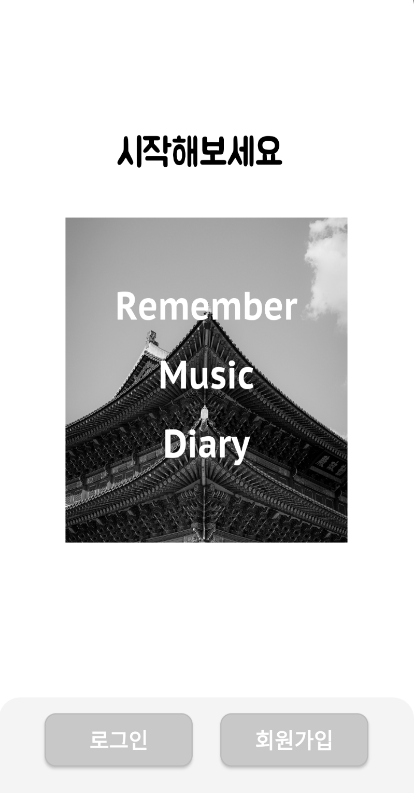
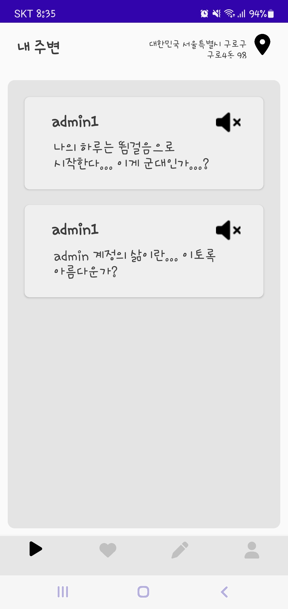
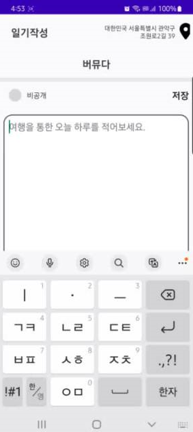
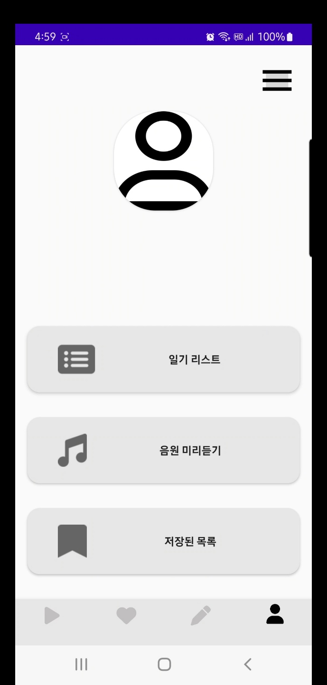
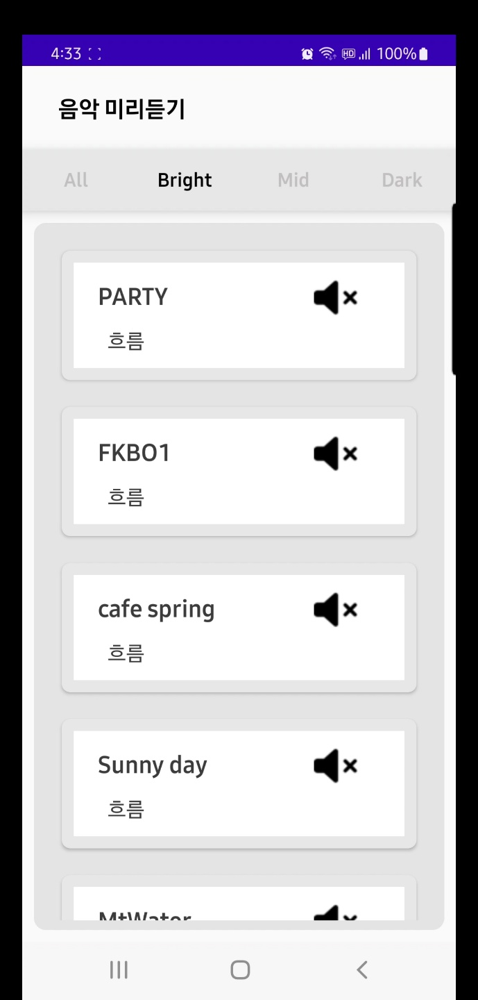
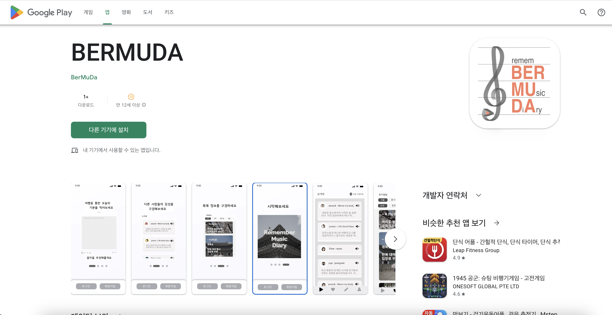

# 🎶 BERMUDA

> 2022 한국관광공사 카카오 주관 ‘2022 관광데이터 활용 공모전’ 장려상 수상 🎖️️

'BERMUDA'는 사용자가 일기작성시 감성분석을 통하여 알맞은 음악을 추천해주는 Application 이다. 또한 위치 정보를 포함하고 있어 주변에 있는 다른 사용자의 감성을 함께 공유할 수 있다.

 

## TOUR API 4.0

- 한국 관광공사에서 제공하는 여행 관련 오픈 API
- BERMUDA는 지역별 행사 및 관광정보를 이용

  

## MY Role

- Application UI 디자인
- Android Stuido를 사용하여 Front-End 측 개발 진행
- JWT Token, RetrofitAPI 를 이용. Back-End와 통신
- 한국관광공사의 데이터를 크롤링해 어플에 표시

  
 

    

## Results

### FisrtPage - 첫 화면

> 로그인하기전 가운데 슬라이드 이미지가 있는 모습

 
  

 
    
### MainPage - 메인화면
> 내 위치를 기준으로 주변사람들의 글이 보이는 화면

 
  

    
### API Page - 관광데이터를 보여주는 화면
> 사람들이 지역별 축제정보를 받아올 수 있는 화면

 
  준비중.

    
### Diary - 일기작성 화면
> 일기를 작성할 수 있는 화면

 
  

    
### ProfilePage - 프로필화면
> 사용자의 정보를 수정하고 확인할 수 있는 화면

 
  

### MusicPage - 음악리스트화면

> 등록된 음악들을 미리 들어볼 수 있는 화면

 
  

    
    
## 어플등록화면 - Google Plat Store (현재는 비활성상태)
> 플레이스토어에 등록후 평가받은 화면

 
  

  

### References

- [TOUR API 4.0](https://api.visitkorea.or.kr/#/)
- [2022 수상팀🎖](https://api.visitkorea.or.kr/#/cntBoardDetail?no=2/)

  

**Thank you**
